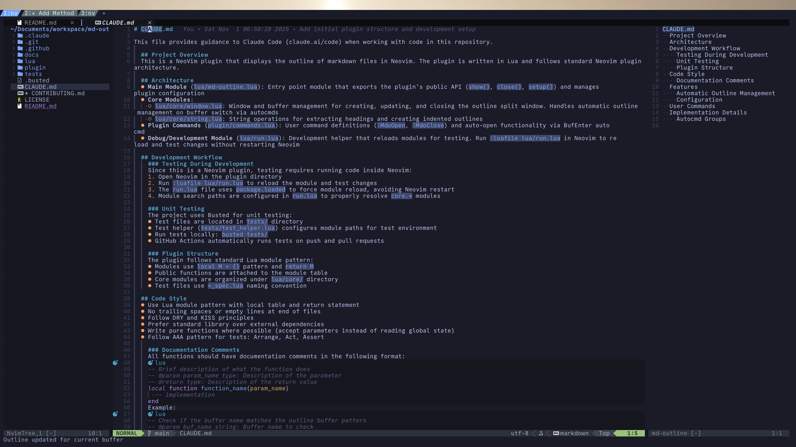
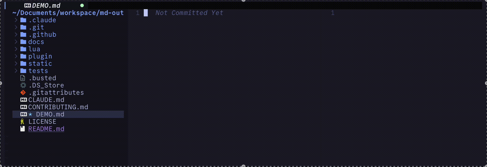

# md-outline.nvim

A Neovim plugin that displays a live outline of your markdown files in a split window.
<br/>


## Features
- **Automatic outline management**: Opens automatically when entering markdown files, closes when leaving
- **Real-time updates**: Outline content updates as you edit the file
- **Current heading highlight**: Highlights the heading corresponding to your cursor position
- **Auto-sync on buffer switch**: Automatically updates the outline when switching between markdown files


## Installation(example for [lazy.nvim](https://github.com/folke/lazy.nvim))
Simple installation
```lua:.~/.config/nvim/plugins/md-outline.lua
return {
  'tttol/md-outline.nvim',
}

```

To configure options
```lua:.~/.config/nvim/plugins/md-outline.lua
return {
  'tttol/md-outline.nvim',
  opts = {
    auto_open = false -- default: true
  }
}

```

## Usage

### Basic Commands

- `:MdoOpen` - Open the markdown outline in a split window
- `:MdoClose` - Close the outline window

### Configuration

```lua
require('md-outline').setup({
  auto_open = true  -- Automatically open outline for markdown files (default: true)
})
```

#### Options

- `auto_open` (boolean, default: `true`): Enable/disable automatic outline opening when entering markdown files

## How It Works

When you open a markdown file:
1. The outline window opens automatically on the right side (if `auto_open` is enabled)
2. All headings (`#`, `##`, `###`, etc.) are extracted and displayed with proper indentation
3. As you move your cursor, the current heading is highlighted in the outline
4. When you edit the file, the outline updates in real-time
5. When you switch to a non-markdown file, the outline closes automatically

## License

MIT
