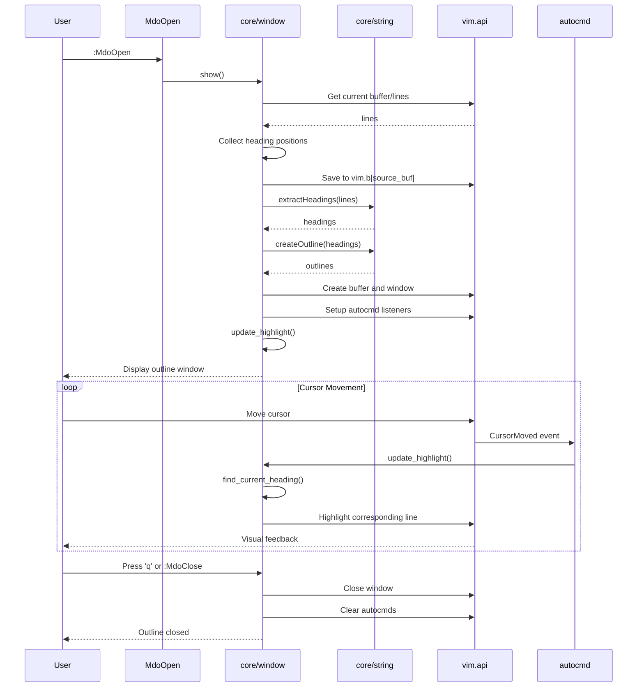
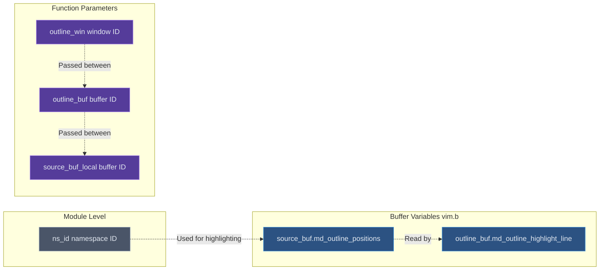

# Window Module Flow Chart

## Overview
This document visualizes the logic flow of `lua/core/window.lua` using Mermaid.js diagrams.

## Complete Interaction Flow

```mermaid
sequenceDiagram
    participant User
    participant MdoOpen
    participant core/window
    participant core/string
    participant vim.api
    participant autocmd

    User->>MdoOpen: :MdoOpen
    MdoOpen->>core/window: show()

    core/window->>vim.api: Get current buffer/lines
    vim.api-->>core/window: lines

    core/window->>core/window: Collect heading positions
    core/window->>vim.api: Save to vim.b[source_buf]

    core/window->>core/string: extractHeadings(lines)
    core/string-->>core/window: headings

    core/window->>core/string: createOutline(headings)
    core/string-->>core/window: outlines

    core/window->>vim.api: Create buffer and window
    core/window->>vim.api: Setup autocmd listeners
    core/window->>core/window: update_highlight()

    core/window-->>User: Display outline window

    loop Cursor Movement
        User->>vim.api: Move cursor
        vim.api->>autocmd: CursorMoved event
        autocmd->>core/window: update_highlight()
        core/window->>core/window: find_current_heading()
        core/window->>vim.api: Highlight corresponding line
        vim.api-->>User: Visual feedback
    end

    User->>core/window: Press 'q' or :MdoClose
    core/window->>vim.api: Close window
    core/window->>vim.api: Clear autocmds
    core/window-->>User: Outline closed
```

## State Management

```mermaid
graph LR
    subgraph "Module Level"
        A[ns_id namespace ID]
    end

    subgraph "Buffer Variables vim.b"
        B[source_buf.md_outline_positions]
        C[outline_buf.md_outline_highlight_line]
    end

    subgraph "Function Parameters"
        D[outline_win window ID]
        E[outline_buf buffer ID]
        F[source_buf_local buffer ID]
    end

    A -.Used for highlighting.-> B
    B -.Read by.-> C
    D -.Passed between.-> E
    E -.Passed between.-> F

    style A fill:#4A5568,stroke:#A0AEC0,color:#E2E8F0
    style B fill:#2C5282,stroke:#4299E1,color:#E2E8F0
    style C fill:#2C5282,stroke:#4299E1,color:#E2E8F0
    style D fill:#553C9A,stroke:#9F7AEA,color:#E2E8F0
    style E fill:#553C9A,stroke:#9F7AEA,color:#E2E8F0
    style F fill:#553C9A,stroke:#9F7AEA,color:#E2E8F0
```

