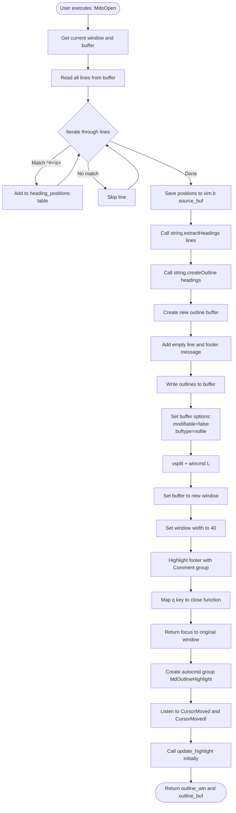
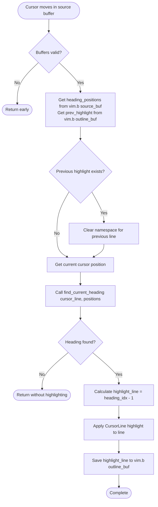
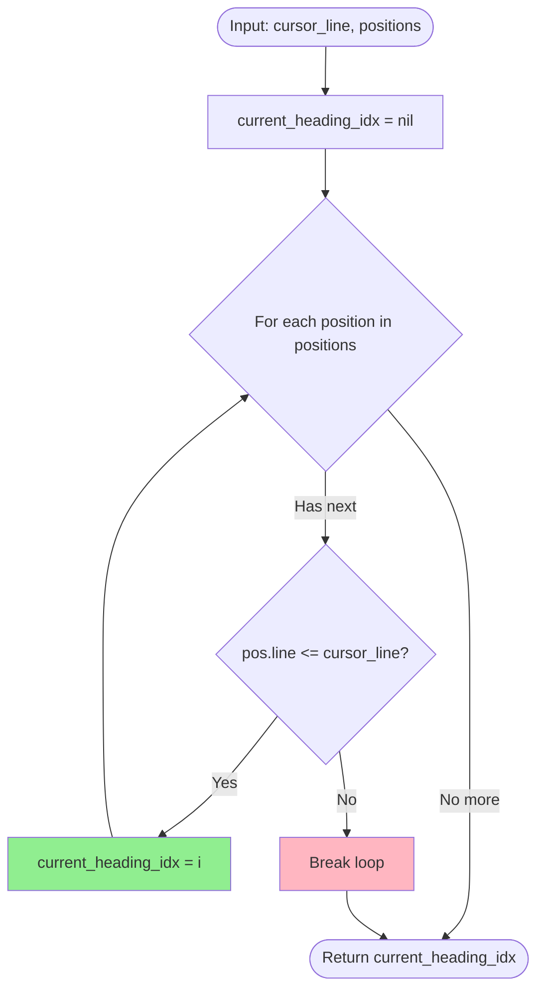
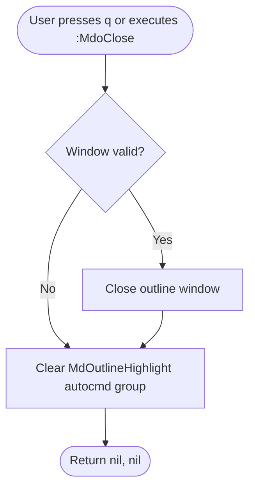
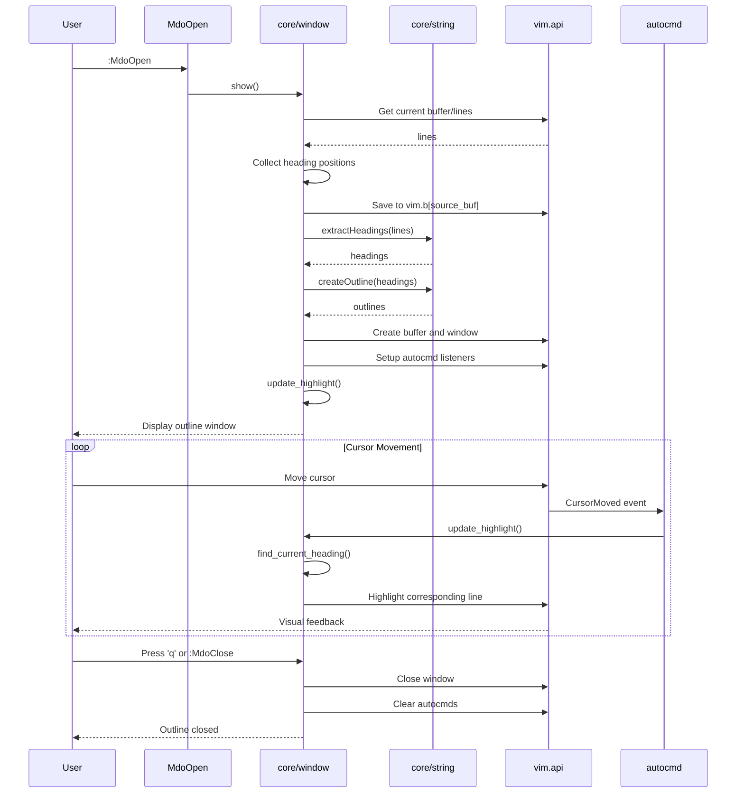
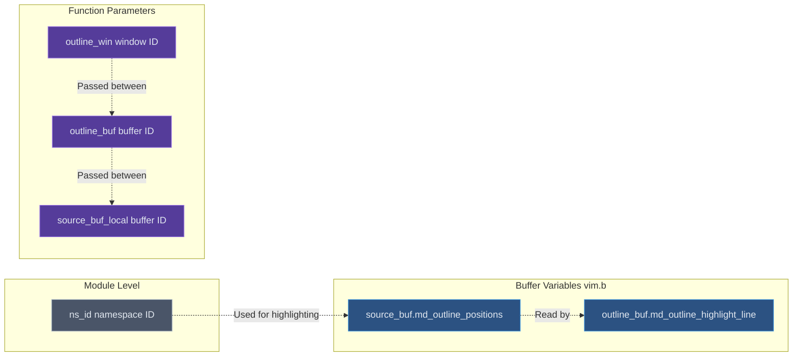

# Window Module Flow Chart

## Overview
This document visualizes the logic flow of `lua/core/window.lua` using Mermaid.js diagrams.

## M.show() - Opening Outline Window

## update_highlight() - Real-time Highlighting

## find_current_heading() - Find Current Section

## M.close() - Closing Outline Window

## Complete Interaction Flow

## State Management

## Key Concepts

### Buffer-Local Variables
- **`vim.b[buf].md_outline_positions`**: Stores heading line numbers and text for the source buffer
- **`vim.b[buf].md_outline_highlight_line`**: Tracks which line is currently highlighted in outline buffer

### Namespace
- **`ns_id`**: Used to manage highlights (add/remove) without conflicts

### Autocmd Group
- **`MdOutlineHighlight`**: Groups cursor movement listeners for easy cleanup

### Pure Functions
- Functions accept all state as parameters instead of relying on global variables
- Makes testing easier and prevents unexpected side effects
